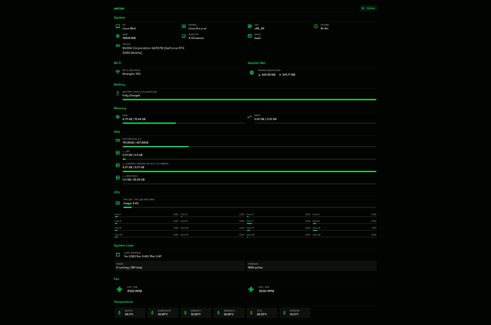

# Sys-Monitor

System resource monitoring dashboard providing real-time hardware statistics.

<p align="center">
  
</p>

## Features
- CPU & Memory usage
- Disk I/O & Storage
- Network Traffic & WiFi signal
- Battery status & Power
- CPU Thermal zones & Fan speeds
- System Load averages

## Development Setup

### 1. Install Dependencies
```bash
uv sync
```

### 2. Run Locally
```bash
uv run flask run --debug
```
Access at `http://127.0.0.1:5000`

## Production Setup (Systemd)

### 1. Install
Ensure Python 3.12+ is installed.
```bash
uv sync
```

### 2. Create Service
Create `/etc/systemd/system/sys-monitor.service`:

```ini
[Unit]
Description=Sys-Monitor Dashboard
After=network.target

[Service]
# Replace with your actual username and path
User=elvin
WorkingDirectory=/home/elvin/Projects/sys-monitor
# Point to the virtual environment binary
ExecStart=/home/elvin/Projects/sys-monitor/.venv/bin/gunicorn -w 4 -b 0.0.0.0:8000 app:app
Restart=always
RestartSec=3

[Install]
WantedBy=multi-user.target
```

### 3. Enable & Start
```bash
sudo systemctl daemon-reload
sudo systemctl enable --now sys-monitor
```

### 4. Verify
```bash
systemctl status sys-monitor
# Logs
journalctl -u sys-monitor -f
```

## Why Docker Won't Work
This application requires direct access to kernel interfaces and hardware sensors:
- `/proc/` (Process info, memory, CPU)
- `/sys/class/` (Thermal zones, power supply, fan control)
- Network interfaces (WiFi stats)

Docker containers isolate these namespaces by default. Running this in Docker would require `--privileged`, `--network=host`, and extensive volume mounting of host system directories, negating the isolation benefits of containerization. Running directly on the host via systemd is the correct approach for hardware monitoring.
